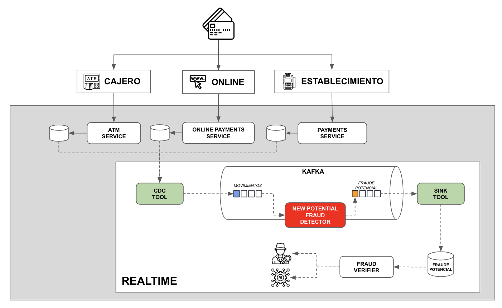
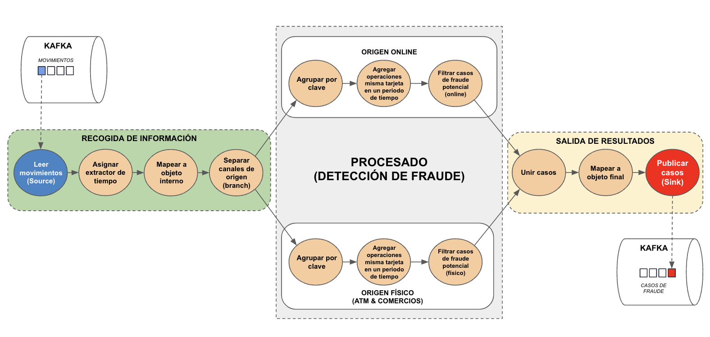

# Detección de Fraude con Quarkus y Kafka Streams

Este proyecto es un ejemplo de detección de fraude usando Quarkus y Kafka Streams. El escenario que se quiere representar
es el siguiente:




Se diseña la siguiente topología:



-> La topología podría ser más plana pero se diseña este tipo para también introducir los conceptos de split y merge dentro de Kafka Streams

## Ejecutando la aplicación

El proyecto consta de un fichero “docker-compose.yml” que levanta toda la infraestructura necesaria:

* Kafka,
* Schema Registry
* Kafka UI (incluye visor para esquemas)


Para lanzar la infraestructura, ejecutamos, desde la raíz:

```bash
docker-compose up
```


Una vez levantada la infraestructura, lanzamos el proyecto de detección de fraude. Para ello, lanzamos en otro terminal:

```bash
cd fraud-checker
/mvnw clean compile quarkus:dev
```

A continuación, cuando la aplicación esté levantada, podemos lanzar un script que genera movimientos físicos y online y fuerza dos casos de fraude de cada tipo (físico y online). Para ello, desde otra terminal y desde la raíz del proyecto, lanzamos:

```bash
sh generate-fraud-cases.sh
```

Al terminar la ejecución del script, veremos las URLs para acceder a la aplicación que nos permite visualizar los topics de Kafka:

```bash
-------------------------------
Topic movimientos: http://localhost:9081/ui/clusters/local/topics/movements
Topic casos de fraude: http://localhost:9081/ui/clusters/local/topics/fraud-cases
-------------------------------
```

Si vamos a la URL correspondiente a los movimientos, veremos que se han publicado 18 movimientos y, si accedemos al topic "fraud-cases" veremos que contiene dos mensajes, correspondientes a un caso de fraude físico y a un caso online
